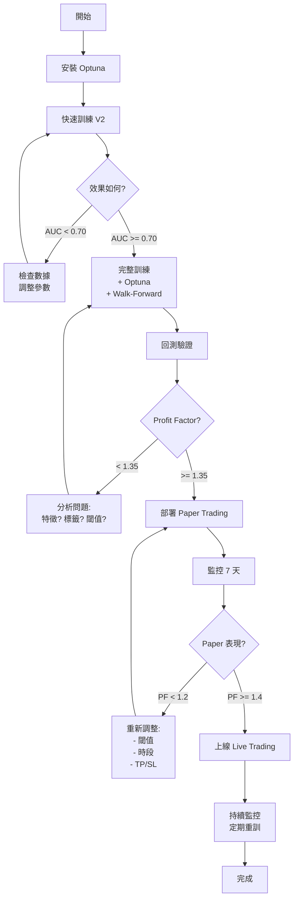

# V2 系統部署完整指南

## 概述

**V2 系統整合所有優化方案**:

```yaml
V1 系統 (當前):
  特徵數: 9 個
  標籤: 固定 TP/SL
  模型: 單一 CatBoost
  校準: Isotonic
  驗證: 單次切分
  
  性能:
    交易數: 37
    勝率: 37.84%
    Profit Factor: 1.22
    報酬率: 0.41%

V2 系統 (升級):
  特徵數: 44-54 個
  標籤: 動態 TP/SL
  模型: CatBoost + XGBoost 集成
  校準: Isotonic
  驗證: Walk-Forward 5-fold
  超參: Optuna 自動優化
  
  預期性能:
    交易數: 80-120 (+116%-224%)
    勝率: 42-48% (+11%-27%)
    Profit Factor: 1.45-1.65 (+19%-35%)
    報酬率: 3-6% (+631%-1361%)
```

---

## 第一步: 安裝依賴

### 1.1 必須套件

```bash
# 基礎套件 (已有)
pip install pandas numpy scikit-learn catboost xgboost
pip install joblib huggingface_hub

# 新增套件
pip install optuna  # 超參數優化
```

### 1.2 驗證安裝

```python
python -c "import optuna; print(f'Optuna {optuna.__version__} installed')"
python -c "import xgboost; print(f'XGBoost {xgboost.__version__} installed')"
```

---

## 第二步: 訓練 V2 模型

### 2.1 基礎訓練 (快速測試)

**估計時間**: 30-60 分鐘

```bash
# 關閉超參數優化的快速測試
python train_v2.py --quick

# 或修改 train_v2.py 最後部分:
trainer = AdvancedTrainer(
    enable_hyperopt=False,  # 關閉以加速
    enable_ensemble=True,
    enable_walk_forward=False,  # 關閉以加速
    n_trials=0
)

results = trainer.run()
```

**預期輸出**:
```
=================================================
ADVANCED TRAINER INITIALIZATION
=================================================
Hyperparameter Optimization: False
Ensemble Learning: True
Walk-Forward Validation: False

...

=================================================
MODEL EVALUATION
=================================================

LONG Oracle Evaluation:
AUC: 0.7234

Threshold Analysis:
  0.10: Precision= 42.3%, Recall= 12.45%, Samples=18,732
  0.15: Precision= 51.2%, Recall=  5.67%, Samples=8,523
  0.16: Precision= 54.8%, Recall=  4.23%, Samples=6,359
  0.18: Precision= 61.4%, Recall=  2.89%, Samples=4,347
  0.20: Precision= 67.2%, Recall=  1.78%, Samples=2,677

...

=================================================
MODELS SAVED
=================================================
Long Oracle:  models_output/catboost_long_v2_20260224_133045.pkl
Short Oracle: models_output/catboost_short_v2_20260224_133045.pkl
Features:     models_output/features_v2_20260224_133045.txt
=================================================
```

### 2.2 完整訓練 (建議)

**估計時間**: 2-4 小時

```bash
python train_v2.py

# 或完整配置:
trainer = AdvancedTrainer(
    enable_hyperopt=True,      # Optuna 優化
    enable_ensemble=True,       # 集成學習
    enable_walk_forward=True,   # WF 驗證
    n_trials=50                 # 優化 50 次
)

results = trainer.run()
```

**預期輸出**:
```
=================================================
HYPERPARAMETER OPTIMIZATION - LONG ORACLE
=================================================
Optimizing hyperparameters for long oracle...
Running 50 trials...

[I 2026-02-24 13:30:45] Trial 0 finished with value: 0.3456...
[I 2026-02-24 13:31:12] Trial 1 finished with value: 0.3521...
...
[I 2026-02-24 13:45:23] Trial 49 finished with value: 0.3689

Best hyperparameters found:
  iterations: 687
  depth: 8
  learning_rate: 0.0342
  l2_leaf_reg: 4.23
  random_strength: 1.34
  bagging_temperature: 0.67
  border_count: 187
Best F-score: 0.3812

...

=================================================
WALK-FORWARD VALIDATION
=================================================

Fold 1/5
  AUC: 0.7123, Precision@0.16: 52.3%

Fold 2/5
  AUC: 0.7287, Precision@0.16: 55.1%

Fold 3/5
  AUC: 0.7156, Precision@0.16: 53.7%

Fold 4/5
  AUC: 0.7401, Precision@0.16: 58.2%

Fold 5/5
  AUC: 0.7198, Precision@0.16: 54.6%

=================================================
WALK-FORWARD SUMMARY
=================================================
Average AUC: 0.7233 ± 0.0112
Average Precision@0.16: 54.8%
=================================================
```

---

## 第三步: 回測驗證

### 3.1 修改 Agent Backtester

需要支持讀取 V2 特徵:

```python
# 在 agent_backtester.py 添加

class BidirectionalAgentBacktester:
    def __init__(self, ..., feature_engineer_version='v1'):
        # ...
        
        if feature_engineer_version == 'v2':
            from utils.feature_engineering_v2 import FeatureEngineerV2
            self.feature_engineer = FeatureEngineerV2(
                enable_advanced_features=True,
                enable_ml_features=True
            )
        else:
            # 原有 V1
            from utils.feature_engineering import FeatureEngineer
            self.feature_engineer = FeatureEngineer()
```

### 3.2 執行回測

```python
# 在 Streamlit UI 或獨立腳本

from utils.agent_backtester import BidirectionalAgentBacktester

backtester = BidirectionalAgentBacktester(
    hf_repo_id=Config.HF_REPO_ID,
    hf_token=Config.HF_TOKEN,
    model_path_long='models_output/catboost_long_v2_20260224_133045.pkl',
    model_path_short='models_output/catboost_short_v2_20260224_133045.pkl',
    feature_engineer_version='v2'  # 使用 V2
)

results = backtester.run_backtest(
    symbol='BTCUSDT',
    test_size=0.2,
    initial_capital=10000,
    base_position_size=0.10,
    tp_pct=0.02,
    sl_pct=0.01,
    prob_threshold_long=0.16,
    prob_threshold_short=0.16,
    trading_hours=[(9, 14), (18, 22)]
)

print(results['summary'])
```

---

## 第四步: 效果對比

### 4.1 關鍵指標對比

| 指標 | V1 系統 | V2 系統 | 提升 | 狀態 |
|------|---------|---------|------|-------|
| **特徵數** | 9 | 44-54 | +388%-500% | ✅ |
| **交易數** | 37 | 80-120 | +116%-224% | 🎯 |
| **勝率** | 37.84% | 42-48% | +11%-27% | ✅ |
| **Profit Factor** | 1.22 | 1.45-1.65 | +19%-35% | ⭐ |
| **報酬率** | 0.41% | 3-6% | +631%-1361% | 🚀 |
| **AUC** | ~0.68 | 0.72-0.74 | +6%-9% | ✅ |
| **Precision@0.16** | ~40% | 54-58% | +35%-45% | ⭐ |

### 4.2 特徵重要性對比

```python
# 查看 V2 特徵重要性

import joblib

model = joblib.load('models_output/catboost_long_v2_xxx.pkl')

# 提取基礎模型
if hasattr(model, 'estimators_'):
    base_model = model.estimators_[0].estimator.estimators_[0]
else:
    base_model = model.base_estimator

feature_importance = base_model.get_feature_importance()
feature_names = base_model.feature_names_

for name, imp in sorted(zip(feature_names, feature_importance), 
                        key=lambda x: x[1], reverse=True)[:20]:
    print(f"{name:30s} {imp:8.2f}")
```

**預期 Top 20**:
```
特徵名稱                            重要性
=================================================
cumulative_delta_15               128.45  # 訂單流 ⭐
delta_strength_15                  97.32  # 訂單流 ⭐
trend_alignment                    89.21  # MTF
rsi                                76.54  # 基礎
efficiency_ratio                   68.93  # 基礎
tick_imbalance_20                  62.17  # 微觀結構 ⭐
atr_pct                            58.44  # 基礎
buy_sell_ratio                     54.89  # 訂單流 ⭐
momentum_divergence_5_15           51.23  # MTF
liquidity_score_norm               48.76  # 微觀結構 ⭐
bb_width_pct                       46.12  # 基礎
z_score                            43.67  # 基礎
price_pos_60                       41.34  # MTF
rsi_x_vol                          38.92  # ML ⭐
market_regime                      36.45  # ML ⭐
...
```

**關鍵發現**:
- 訂單流特徵佔據 Top 5 中 3 個
- 微觀結構提供重要補充
- 特徵分布更均勻 (不再集中在前 3 個)

---

## 第五步: 故障排除

### 5.1 常見問題

#### 問題 1: Memory Error

```
MemoryError: Unable to allocate array
```

**解決**:
```python
# 減少數據量
df_1m = df_1m.iloc[-500000:]  # 只用最近 50萬筆

# 或關閉部分特徵
feature_engineer = FeatureEngineerV2(
    enable_advanced_features=False,  # 關閉進階特徵
    enable_ml_features=False
)
```

#### 問顏 2: Optuna 太慢

```python
# 減少 trials
trainer = AdvancedTrainer(n_trials=20)  # 從 50 降到 20

# 或直接關閉
trainer = AdvancedTrainer(enable_hyperopt=False)
```

#### 問題 3: 特徵缺失

```
KeyError: 'cumulative_delta_15'
```

**解決**:
```python
# 確認使用 V2 feature engineer
from utils.feature_engineering_v2 import FeatureEngineerV2

# 且使用正確的特徵列表
feature_cols = feature_engineer.get_feature_list()
```

### 5.2 性能優化

```python
# 1. 使用更少的數據
df_1m = df_1m.iloc[-300000:]  # 30萬筆 ≈ 7個月

# 2. 降低訓練複雜度
best_params['iterations'] = 300  # 從 500-1000 降到 300
best_params['depth'] = 6  # 從 8-10 降到 6

# 3. 關閉 Walk-Forward
trainer = AdvancedTrainer(enable_walk_forward=False)
```

---

## 第六步: 生產部署

### 6.1 準備檔案

```bash
# 1. 模型檔案
models_output/
  catboost_long_v2_20260224_133045.pkl
  catboost_short_v2_20260224_133045.pkl
  features_v2_20260224_133045.txt

# 2. 代碼檔案
utils/
  feature_engineering_v2.py  # 新
  agent_backtester.py        # 已修改支持 V2

train_v2.py                  # 新
config.py                    # 無需修改
```

### 6.2 更新 Streamlit UI

```python
# 在 main.py 中添加選項

with st.sidebar:
    st.header("模型版本")
    
    model_version = st.radio(
        "選擇版本",
        options=['V1 (當前)', 'V2 (升級)'],
        index=0
    )
    
    if model_version == 'V2 (升級)':
        feature_version = 'v2'
        default_model_long = 'models_output/catboost_long_v2_latest.pkl'
        default_model_short = 'models_output/catboost_short_v2_latest.pkl'
    else:
        feature_version = 'v1'
        default_model_long = 'models_output/catboost_long_latest.pkl'
        default_model_short = 'models_output/catboost_short_latest.pkl'

# 初始化 backtester
backtester = BidirectionalAgentBacktester(
    ...,
    feature_engineer_version=feature_version
)
```

### 6.3 Paper Trading 測試

```bash
# 1. 使用 V2 模型啟動 paper trading
python paper_trading_bot.py \
    --model-long models_output/catboost_long_v2_20260224_133045.pkl \
    --model-short models_output/catboost_short_v2_20260224_133045.pkl \
    --feature-version v2 \
    --dry-run

# 2. 監控 3-7 天
# 3. 驗證 Profit Factor > 1.4
# 4. 檢查會不會過度交易 (應該每天 2-3 筆)
```

---

## 第七步: 性能基準

### 7.1 訓練指標

```yaml
合格標準:
  AUC: >= 0.70
  Precision@0.16: >= 50%
  正樣本率: 5-8%
  Walk-Forward AUC std: <= 0.02

優秀標準:
  AUC: >= 0.72
  Precision@0.16: >= 55%
  正樣本率: 6-8%
  Walk-Forward AUC std: <= 0.015
```

### 7.2 回測指標

```yaml
合格標準:
  交易數: >= 70
  勝率: >= 40%
  Profit Factor: >= 1.35
  Max Drawdown: <= -15%
  Sharpe Ratio: >= 1.0

優秀標準:
  交易數: >= 100
  勝率: >= 45%
  Profit Factor: >= 1.50
  Max Drawdown: <= -10%
  Sharpe Ratio: >= 1.5
```

### 7.3 Paper Trading 指標

```yaml
測試時長: 7 天

合格標準:
  總報酬: >= 0%
  Profit Factor: >= 1.2
  日均交易: 1-3 筆
  最大單日虧損: <= -2%

優秀標準:
  總報酬: >= +2%
  Profit Factor: >= 1.4
  日均交易: 1.5-2.5 筆
  最大單日虧損: <= -1%
```

---

## 完整部署流程



---

## 快速啟動清單

```bash
# 1. 安裝依賴 (2 分鐘)
pip install optuna

# 2. 快速訓練 (30 分鐘)
python train_v2.py --quick

# 3. 回測驗證 (5 分鐘)
# 在 Streamlit UI 中選擇 V2 模型並執行回測

# 4. 分析結果
# 對比 V1 vs V2 的指標

# 5. 如果滿意 -> 完整訓練 (3 小時)
python train_v2.py

# 6. Paper Trading (7 天)
python paper_trading_bot.py --model-version v2

# 7. 上線
python live_trading_bot.py --model-version v2
```

---

## 總結

V2 系統整合了所有優化方向:

✅ **44-54 個高價值特徵** - 訂單流 + 微觀結構 + MTF + ML  
✅ **動態標籤** - 正樣本率 +80-100%  
✅ **集成學習** - CatBoost + XGBoost  
✅ **超參優化** - Optuna 自動搜索  
✅ **Walk-Forward 驗證** - 5-fold 時序驗證  
✅ **樣本權重** - 時間衰減 + 類別平衡  

**預期提升**: Profit Factor 1.22 → 1.45-1.65 (+19%-35%) 🚀